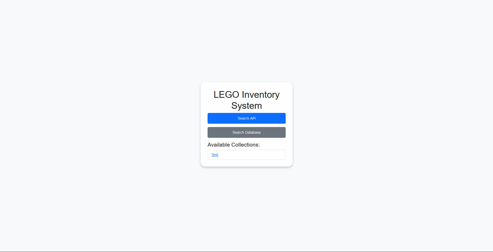
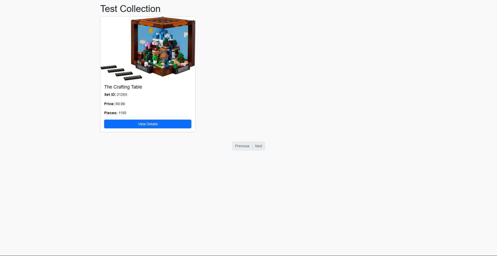

# LIS  -  Lego Inventory System - by Jonas Heilig

LIS is a Lego Inventory System - The final version should be a use full Assistant for every Lego Lover.  

## Features:
- Get Legosets infos from Brickset API and save it to a local DB
- Search in the Local DB after Sets
- Sort all your Legosets in lists

# Routes:
- / -> Main Page - Navigate to all other Pages
- /search_api -> Search in Brickset API
- /search_db -> Search Local
- /add_to_collection/<int:set_id> -> Add a Set to your Collection
- /collection_list -> Show all Sets in your Collection

# How to use:
- Clone the Repo
- Install the requirements
- Change config.py
- Run the app.py

# Preview:

Pictures are in the folder preview-pictures  
Here some Pictures of the App:  
Main Page: 

API Search: 

DB Search:  

Results:  

Show a Collection:  
